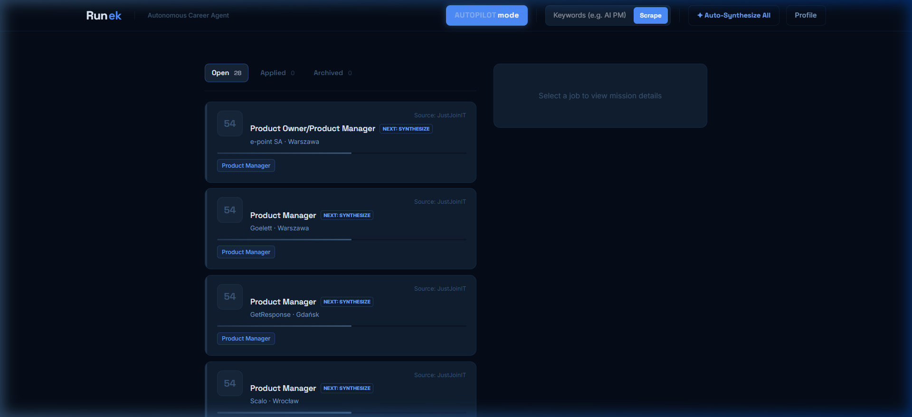

# Runek | Autonomous Career Agent

Runek is a "Local-First" AI agent that automates your job hunt. It finds, scores, and applies to jobs autonomously, keeping all your data private on your own machine.

## ⚡ Quick Start
1. **Download**: Click the button above to download the latest source code.
2. **Launch**:
   - **Windows**: Double-click `Start-Runek.bat`
   - **Mac/Linux**: Run `bash start-runek.sh` in your terminal.
3. **Go**: The dashboard will open automatically at `http://localhost:3000`.

## ✦ Key Features
- **Autopilot**: Playwright-powered agent that handles application forms for you.
- **Match Scoring**: Roles are ranked (0-100) based on your custom profile criteria.
- **Mission Setup**: Configure your Country, Job Title, and Skills in the **Profile** tab.
- **Zero Friction**: No setup, no login, no database. Just clean automation.
- **Privacy First**: All your personal data (CV, API keys, profile) is stored in the `userdata/` folder, which is automatically ignored by Git and never leaves your machine.

## 📄 Documentation
For details on the engine, safety modes, and advanced configuration:
👉 **[Full Documentation](./project-documentation/feature-runek-autopilot.md)**
